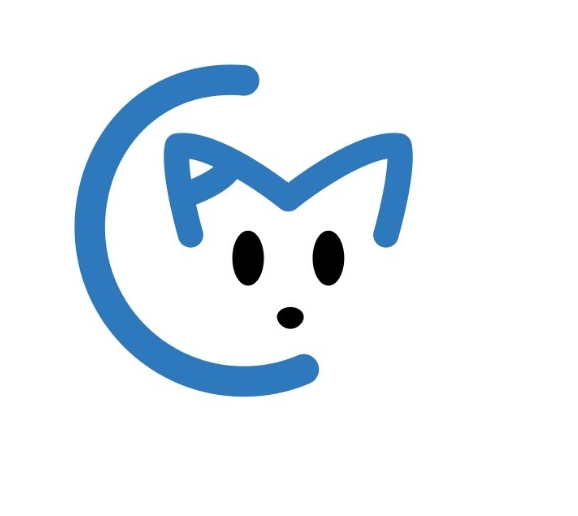
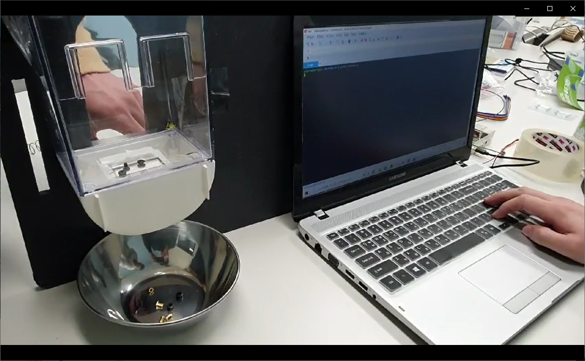
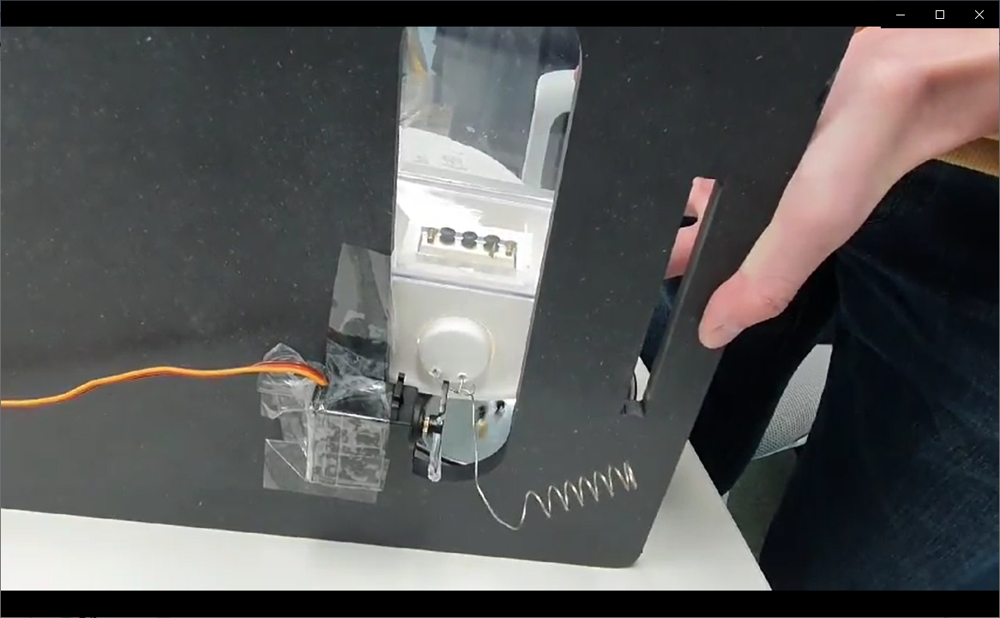
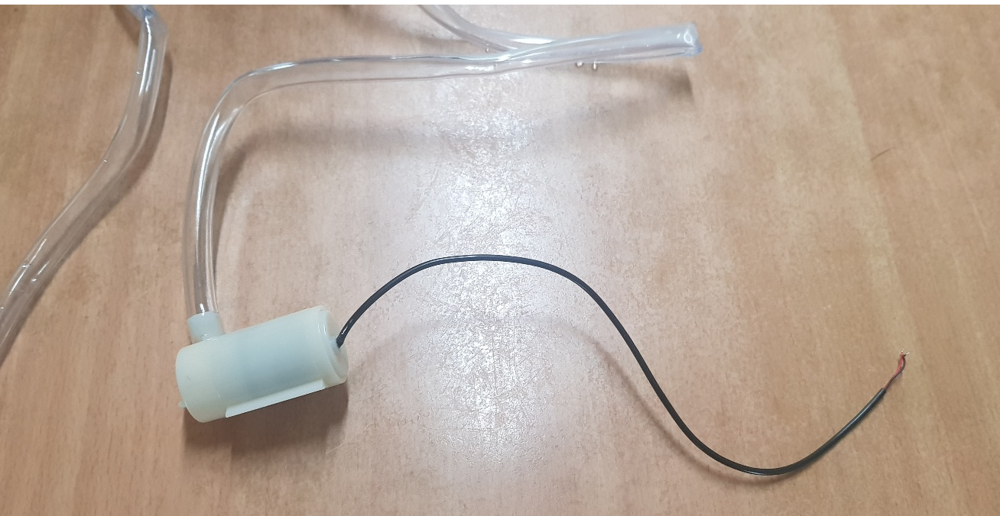

### 한림대학교 2021년 1학기 BigData Capstone Design
# 반려동물 케어 시스템 (Animal Care System)

### 팀명: ACM(Animal Care Manager)
> 

|학과|학번|이름|비고|
|----------|---------|----------|---------|
|컴퓨터공학과|20165147|유병학|팀장|
|빅데이터전공|20165142|양성웅|팀원|
|빅데이터전공|20165153|이재성|팀원|
|빅데이터전공|20165164|지현한|팀원|
<br>

- 지도교수 : 고영웅 
- 참여기업 : (주)인반트
----------------------
## 개발 배경
- 본 팀에서 제안하는 **반려동물 케어 시스템**은 스마트 IoT 기술을 사용하여 자동으로 반려 동물을 케어하는 다양한 기능을 제공한다. 
- 1인 가구 증가로 인해 외출 시 혼자 집에 혼자 남겨지는 반려동물이 많다. 제안하는 시스템을 통해 **집에 혼자 남겨진 반려동물을 자동으로 관리하는 것이 본 프로젝트의 주요 목표이다.**

----------------------
## 개발 목표 및 내용 
#### 개발 목표
1. 주인이 사료와 물을 주지 않아도 일정 시간이 되면 자동으로 사료와 물을 공급하는 기능
2. 온도 센서를 부착하여 반려동물의 집이 추워지면 설치한 열선으로 통해 난방기구로서의 역할을 하는 기능
3. 주인의 휴대폰과 연동하여 외부에서 원격으로 사료와 물을 주는 기능
4. 카메라를 통해 반려동물의 상태를 실시간으로 확인할 수 있는 기능

#### 개발 환경
- Raspberry pi
    - Raspbian(라즈비안) OS 사용
- Xshell 6, PuTTY 등을 통해 접속하여 Raspberry pi를 제어
- python 언어를 통해 모듈 제어
    - 사료 주기 및 서보 모터 모듈 제어
- Android Studio
- html, php 페이지 구성

### 진행 상황
- 반려동물 집 
    
     

- 사료주기 테스트
    
    [사료주기_테스트1.mp4링크](https://github.com/jaeseonglee/BigData_Capstone_Design/blob/main/Vedio/사료주기_테스트1.mp4)

     

    [사료주기_테스트2.mp4링크](https://github.com/jaeseonglee/BigData_Capstone_Design/blob/main/Vedio/사료주기_테스트2.mp4)
    
     

- 테스트 중 사용된 코드 일부
    ```python
    import GPIO.RPi as GPIO # GPIO pin을 사용
    GPIO.setmode(GPIO.BOARD) # BOARD 기준의 pin을 사용
    GPIO.setup(12, GPIO.OUT) # 12번 pin을 출력으로 설정
    pwm = GPIO.PWM(12, 50)   # 50Hz
    ```
- 워터 펌프모듈을 통해 물 공급을 계획

    
    
    [워터펌프.mp4링크](https://github.com/jaeseonglee/BigData_Capstone_Design/blob/main/Vedio/워터펌프.mp4)

- 카메라 모듈을 통해 현재 상황을 확인

    

- 온도 센서를 통해 온도 측정 및 온도에 따라 온열 매트 작동

    

    

## 전체 케어 시스템 구성
- 시스템의 구조도와 라즈베리파이 회로도

     

- 케어 시스템과 애플리케이션    

    

- 전체적인 구조

    


    [시연동영상.mp4링크](https://github.com/jaeseonglee/BigData_Capstone_Design/blob/main/Vedio/시연동영상.mp4)

----------------------
## 기대효과
- 1인 가구 증가로 많은 반려동물이 혼자 있게 되는 경우가 많은데, 이때 자동으로 식사와 물을 제공함으로써 반려동물의 올바른 식습관으로 건강을 챙길 수 있다.
- 카메라를 설치하여 반려인이 실시간으로 스마트폰으로 반려동물의 상태를 확인하고 케어할 수 있는 서비스를 제공한다.
-  출장이나 여행같은 장기간 부재시 펫 시터나 반려동물 호텔 등에 맡기지 않아도 제공되는 서비스로 케어가 가능하므로 비용적인 부담을 줄여줄 것이다.
-  확장성이 좋은 Raspberry Pi를 사용하여 개발하기 때문에 추후 피드백을 통해 기능을 추가한다.

----------------------
#### 기타 사항
- 매주 월요일 14시에 비대면/대면 회의를 통해 의견을 모으며 프로젝트 진행.
- 추가적인 회의가 필요하거나 문서 작성 등의 일정은 다른 요일이나 비대면으로 일정 진행.

|날짜|장소|내용|
|----|------|----|
|03.15|비대면|주제에 대한 첫 회의 및 일정 조정 등|
|03.16|비대면|계획서 작성 등|
|03.22|공학관 멘토링실 2|초기 기획 및 Raspbeery Pi 등 주문 |
|03.29|공학관 멘토링실 4|Raspbeery Pi 도착, 견적서 및 증빙서 등을 제출|
|03.31|공학관 멘토링실 1| 견적서 정정 및 회의 |
|04.05|공학관 멘토링실 4| Raspberry Pi 모듈 다루기 및 회의 |
|04.08|공학관 멘토링실 4, 강의실 1102| 추가 회의 및 서보 모터 다루기 등|
|04.12|공학관 멘토링실 1| 중간 보고서 작성 및 추가 회의|
|04.14|비대면|중간 보고서 작성 및 추가 회의|
|04.26|공학관 A1409| 사료, 물 공급 마무리 단계 및 회의|
|04.28|공학관 A1409| 지도교수님과 면담, 카메라(스트리밍),열선 등을 확인|
|04.30|비대면|추가 회의|
|05.03|공학관 A1409| 어플리케이션 제작 시작 및 라즈베리파이 추가 사용 등 프로젝트 진행 및 회의|
|05.05|공학관 A1409| motion 프로그램을 통한 카메라 모듈 동작 확인 및 추가 회의|
|05.10|공학관 A1409| 서보 모터(사료 공급) 재조정, 워터펌프 재조정 등 보수 작업 및 추가 회의|
|05.11|공학관 A1409| 캡스톤 디자인 멘토링 - 가온미디어 조진표 멘토링님과 줌을 통한 임베디드 시스템 멘토링 및 추가 회의|
|05.17|공학관 A1409| 하드웨어 제작, 보수 작업, 회의 |
|05.21|공학관 A1409| 하드웨어 제작, 웹 페이지와 카메라 모듈 문제 발생, 추가  회의|
|05.24|공학관 A1409| 하드웨어 마무리 단계(라즈베리 파이 및 모듈 부착), main 코드 작성|
|05.27|-| 지도 교수님과 짧은 면담(피드백 또는 질문)|
|05.30|공학관 A1409| 하드웨어 마무리 단계, 무게 센서 사용에 대해 회의|
|05.31|공학관 A1409| 하드웨어 마무리 단계, 무게 센서 미사용 -> 카메라 모듈로 대체|
|06.01 ~ 06.10|공학관 A1409 및 비대면| 케어 시스템 완성 및 캡스톤 제출 서류 작성 등|


---------------------------
#### 참고 문서

서보모터:
    
https://m.blog.naver.com/chandong83/221850060160

온도 센서:

https://qastack.kr/raspberrypi/3606/ds18b20-temperature-sensor-not-listed

https://blog.naver.com/zmfla6752/222023915079

고정 IP:   

https://ansan-survivor.tistory.com/44

라즈베리파이 위키:

https://wikidocs.net/3172

5V 릴레이모듈과 워터펌프:

https://www.youtube.com/watch?v=bEPHRffREe4

MOTION:

https://m.blog.naver.com/icbanq/221761437794
    
https://developmentdiary.tistory.com/486
    
https://www.youtube.com/watch?v=NlgQcGXoCG4

파이썬 병렬처리:

https://docs.python.org/ko/3/library/multiprocessing.html
